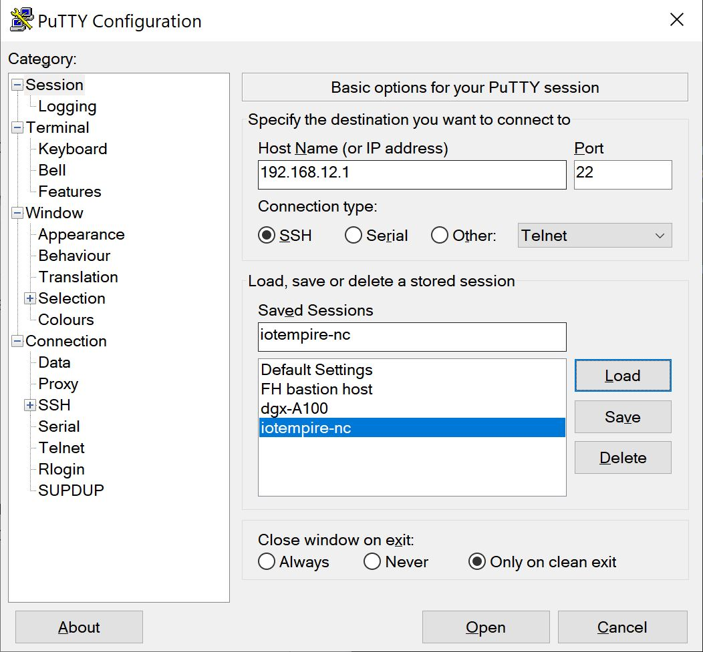
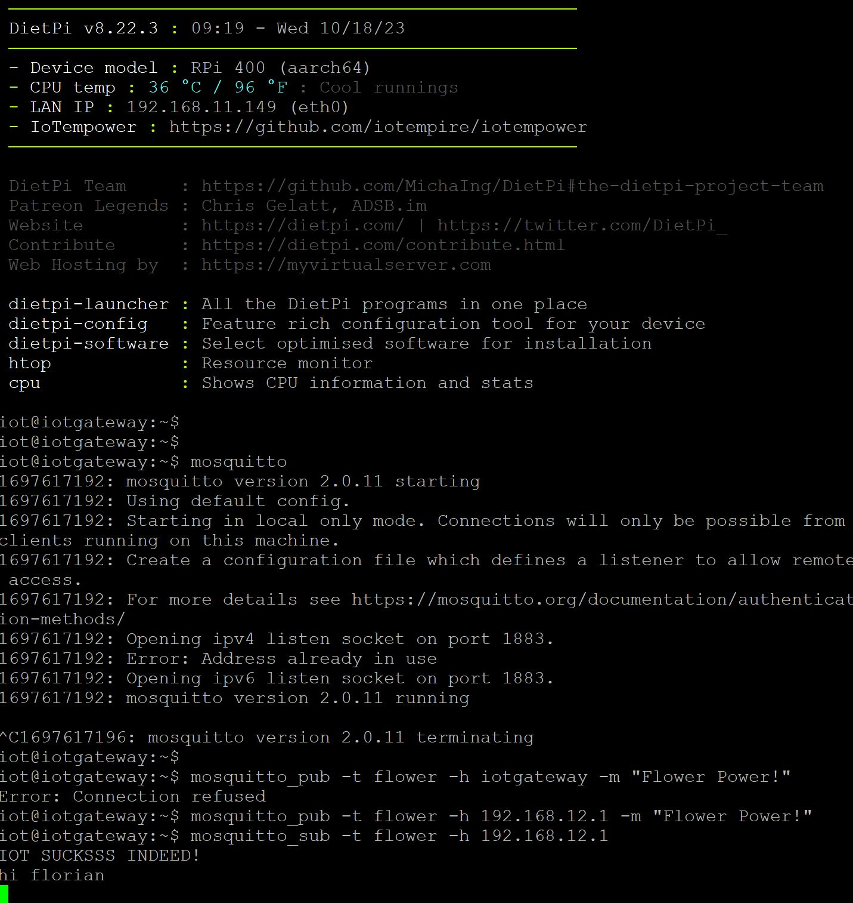
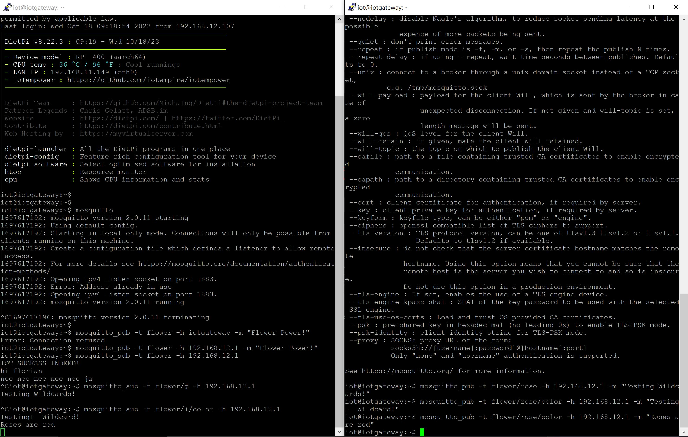
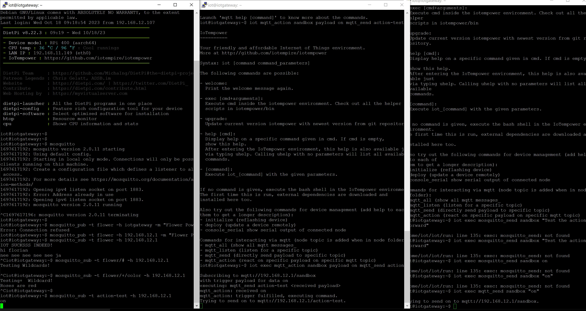

# Exercise 03
For the third exercise we worked with the MQTT protocol.

## Tasks

### Communicate with MQTT Server
To test out the MQTT Server running on the IoTempower gateway I first connected to it via ssh. Therefore I used the PUTTY ssh client with the following configuration:
    
After that I subscribed to a Topic. Next I opened another shell session and published some example text on the same topic, which can be seen on the following screenshot (The publish in this case came from a different computer).
    

### Use Wildcards
The next exercise was to use the Wildcards "#" and "+" publish and recieve messages. 
The "#"" wildcard in MQTT is a multi-level wildcard that matches multiple levels in the topic hierarchy, allowing you to subscribe to and receive messages from all topics under a given level.
The "+"" wildcard in MQTT is a single-level wildcard that matches a single level in the topic hierarchy, enabling you to subscribe to and receive messages from topics that share the same parent level.
The usage of these Wildcards can be seen in the following example:
    

### Use MQTT_Action
We have also made use of the "mqtt_action" command. This command can be used to execute a certain thing after a specific message is being recived. In the follwing example we used it, to forward the recieved message to a different topic. For this task I needed 3 differnt shell windows. One for registering the action, one for subscribing to the topic that the action forwards to and one for publishing the message to the topic the action is listening to.
    

### Make Air conditioning integrator
At the time this exercise was done (18.10. - 11:30) I had a meeting with my Bachelor Coach Prof. David Schedl and therefore was not able to finish the exercise.

## Problems and Conclusion
We have fried one LED because we connected it and didn't have the resistor placed yet.
