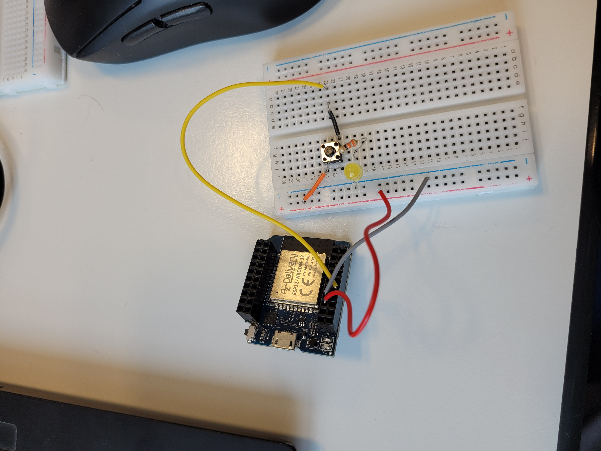
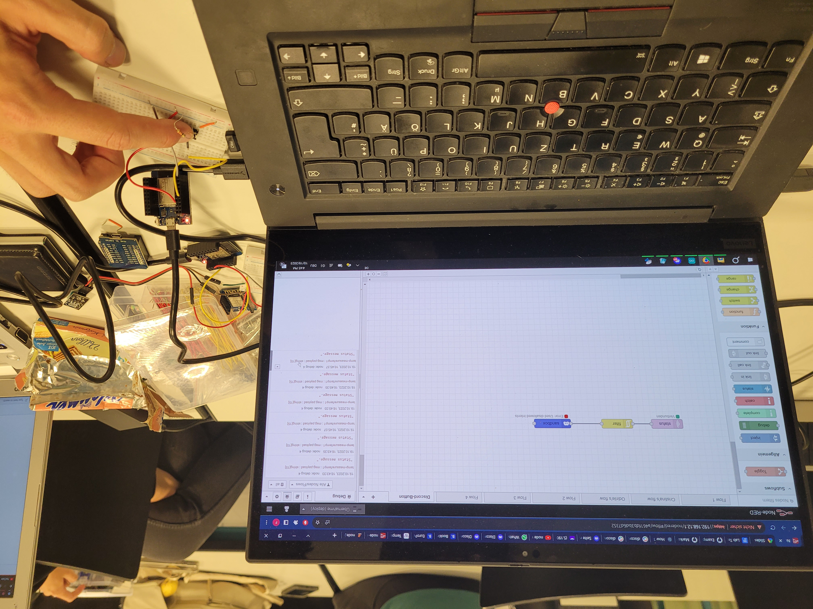

# Exercise 04
For the fourth exercise we continued working with ESPMicrocontrollers and connected them with NodeRED.

## Tasks

### Emergency Button
In this Task we want to publish a Message in to the IoTempire discord server by just pressing a Button.

Therefore as a first step we had to make an ESP32 register a Button Press and publish it to the local MQTT Server. For capturing the Button input we used the following circuit (without the LED).
    

After that, we flashed the following [script](../../../Team/code/MQTT-Button-Publish-Status/) on the ESP32, to publish a Message to the MQTT server with the topic "status". After that we did we used NodeRED to subscribe to this topic and recieve the message. We also installed the node-red-contrib-discord-advanced module on NodeRED so we could communicate with discords API. 

Next we set up a discord bot and got a token as well as a link we could share with our teacher to recieve the necessary permission for the bot to post messages in the sandbox thread in the IoTempire discord server. However when we tried to send the recived message to the discord server with the "discordMessageManager" Node we always recieved an Error "Used disallowed intents". This indicates that our bot propably didn't recive the required access rights from our teacher. We might still try to fix this tomorrow.
    

Finally we got it to work. We realised that we have uploaded a similar but not the right program on the ESP32. The result can be seen in the following picture.
    

## Problems and Conclusion
I have created a shortcut by accident when I was setting up the circuit for the Emergency Button. Thankfully all the components are still fine.