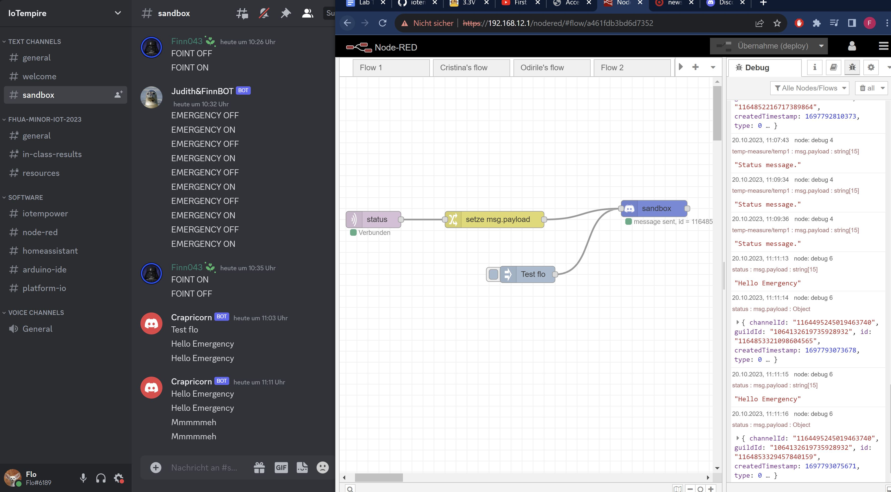

# Exercise 05
For the fifth exercise we focused on exploring and using the IoTempower framework.

## Tasks

### Commands

### Check out documentation server

### First Node

I started to follow the tutorial. Then I ran into the problem, that in Chrome JS couldn't be executed if I'am on an "unsafe" tab. Therefore I downloaded the Firefox browser and continued with the task.
We changed the conf file to board="esp32minikit".
After that I created a new Node and deployed a cpp script to switch on the LED on button press. We were having a lot of trouble because it was not showing any button press in the debug.

The I made another node folder and initialized Serial on another D1 mini.

I liked how it magically deploys over wifi.

    

## Problems and Conclusion
