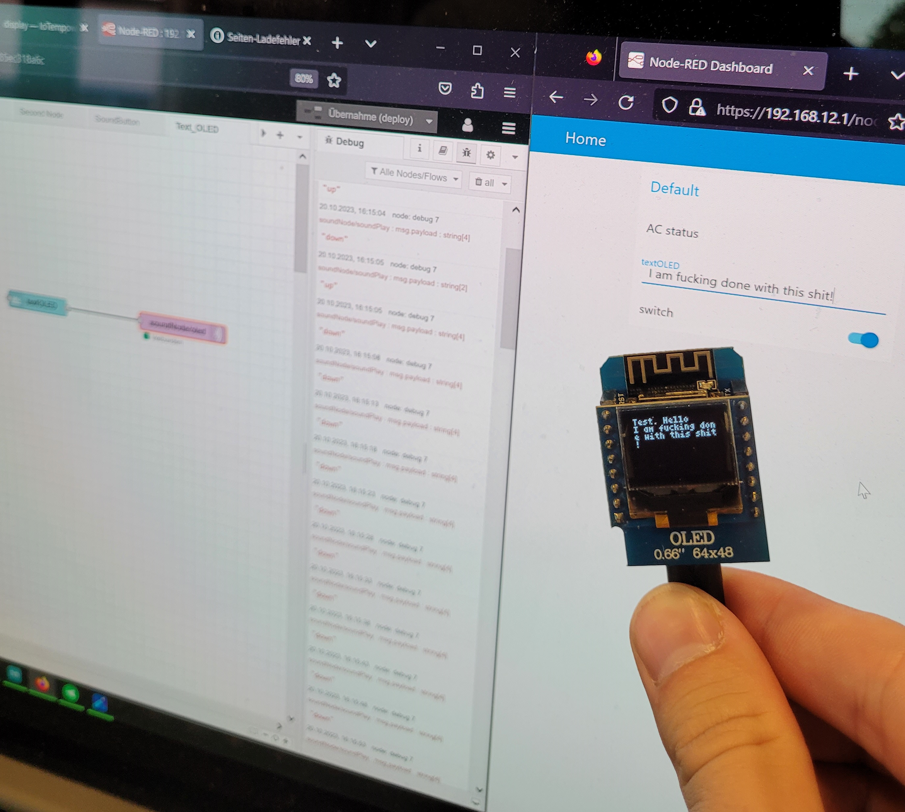

# Exercise 05
For the fifth exercise we focused on exploring and using the IoTempower framework.

## Tasks

### Exploring IoTempower Services and Commands
For the commands it felt hard/impossible to guess what they are exactly doing and I prefered to just read the documentation about them.
The task about checking out the documentation server and about the Ultrasonic sensors was confusing me very much and I couldn't figure out how to get to the documentation server and what exactly I should get out of this task. I then decided to rather work on practical tasks as we had plenty of them and not very much time.

### First Node

I started to follow the youtube tutorial and opened the Cloud Commander with the example folder at the IoTGateway. Then I ran into the problem, that in Chrome JS couldn't be executed if I'am on an "unsafe" tab (Because I could only access the gateway via it's local IP it was marked as unsafe). Therefore I downloaded the Firefox browser and continued with the task. Next I created a new node-folder and changed the setup.cpp to have a button that publishes on the topic "(myTestNode/)b1".
Meanwhile we have also set up a simple circuit to record a button press on an ESP32. 
    
Next we initialized the serial by plugging the ESP32 into the RaspberryPI, so it is registered on the IoTempower gateway and the Code is deployed. At first this didn't work because we had the wrong device set up in the conf file.
    
After changing the conf file to expect a board="esp32minikit" the initialization worked.
    

After initializing once code changes can be deployed over the wifi network and the device doesn't have to be plugged into the RaspberryPI anymore.
When we wanted to register the Button press we were having a lot of trouble because it was not showing any button press in the debug of the ArduinoIDE. Later we found out that it was worked all along in the IoTempower shell by using the mqtt_listen command.
    

### Second Node
The next task was to introduce a second node and to controll it's ESPs LED by pressing the Button of the first node. The setup process was similar to the first node and wont be mentioned in detail. The setup.cpp file was edited to contain an LED like seen in the following picture. 
    
After that I made a NodeRed flow which subscribes to the MQTT topic "myTestNode/b1" which registered the button press. Next I added a switch node which checks for the value "up" as I only want react once on a given button press. Then I add a toggle node to switch between on and off every time.
    
 At last I publish a MQTT message on the topic "secondNode/blue/set". The "/set" topic is automatically listened to by IoTempower and sets the value of the LED, like can be seen in the following console output.
    

### Button to sound and notification
The next task was to induce a sound and a notification by pressing the button on the ESP32 circuit. The previous button was reused for this purpose. Next I created a simple NodeRED flow. I get the Button press and only accept "up" values just like before. After that I used the "SoundOut" and "show notification" nodes to produce the sound and the notification which can be seen on the NodeRED dashboard like in the following picture.
    

### Text receiver
At last we wanted a mini OLED screen to recieve Text from the NodeRED User interface. Therfore we mounted the 64x48 OLED Screen on top of the ESP32. Next I changed the setup.cpp to contain the following code and deployed it again. 
    
The NodeRED flow to achive this task was very simple and just contained a "text input node", as well as a MQTT publish node. After typing text into the NodeRED User interface it was visible like it can be seen in the following picture.
    

## Problems and Conclusion
I have to say, that doing all these tasks was too much for one day. Just finishing the tasks could not be done during the time we had in class (at least for someone who has no prior IoT knowledge) so I was staying in university substantially longer. But after that I have not even written a single line of documentation, so I had to do all of this in my freetime at the weekend. Not very much fun...
