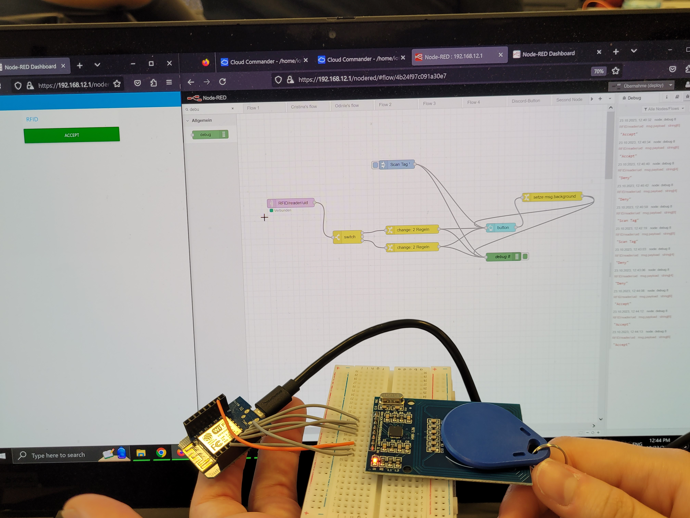

## RFID Reader
As a first task we started setting up the RFID reader. Therefore we created the ciruit in the following picture and connected all the pins as explained in the instruction.

    

Then we created a new Nodefolder for RFID and changed to setup.cpp to have a "mfrc522(reader);" and initialized it on the D1 Mini.
After that we created a new NodeRED flow, in which we first check if the ID equals to the ID of the tag we scanned in earlier. If so, change Button Color to Green and the Text to "accept". Otherwise we switch the color to red and the text to "deny". Originally the button is set to "scan tag" as well as every time after pressing the button. The function can be seen in the following pictures.

    
    
    
    
    

## Pulse Width Modulation

### Lighting LED
In Pulse width Modulation two parameters can be controlled: frequency, and strength (the length of the pulse).In this way the brightness of a LED can be controlled. Therefore I set up a new Nodefolder called "PWM", changed the device in the node.conf to a "esp32minikit" and changed the setup.cpp to contain the line "pwm(pwmDevice, 4);". At first I had some Errors trying to use the PWM device. We then run "iot upgrade" on our RaspberryPI which fixed the problem.

    
Next we created a simple NodeRED Flow with a Userinterface with a slider which can be used to controll the strength of the pulse. At first this didn't work for a long time and we didn't know why. In the end we realized that our LED wasn't working and just replaced it. The working result can be seen in the next pictures.
    
    

### Buzzer

In the next exercise we reused the parts from before. We only added another slider in the NodeRED UI to also be able to controll the frequency. The frequency can be set on the same topic by just adding frequency at the back (in this case: "PWM/pwmDevice/frequency/set"). In the circuit we just replaced the LED with the Buzzer. 

    
    
    
    

### RGB Light

Next we wanted to controll a RGB Light with three different phases to controll each color individually. I reused the Node for the PWM exercises and changed the setup.cpp to contain the proposed "rgb_single(rgb1, 4, 0, 2, true);". Sadly this wouldn't work as it couldn't find the responsible library.
    
That's why we tried doing it by defining three individual pwm-devices on three different pins. After that we ran into big trouble in NodeRED. We used the ColorPicker node which returns the RGB values not in the right format. We then tried to take appart the values in a function as can be seen in the following picture. Only then we realized that the pwm-devices won't accept hexadecimal values.

    
As we have spent already way to much exercise we didn't want to wright a new function to take apart the RGB string in the correct way. We did manage to turn on the lights in the console though as can be seen in the next image.
    

## Access Controll System
At last we created the Access Controll System. Therefore we reused the RFID project from befor. To the circuit we added a mini-traffic light, a buzzer and the Lock as can be seen in the picture.
    
After that we changed the setup.cpp to have some generall outputs for the traffic light, for the lock and for a pwm-device for the buzzer as can be seen here.
    
I deployed the changes and started changing the previous NodeRED flow from the RFID task. There I added a bunch of new MQTT-Out nodes to access the Pins for the Light, the Buzzer and the lock. I also added a delay node to turn off the Buzzer after 1 second. The lock didn't work as expected. The next day we found out that the lock needs 12V and which explains why it didn't work, but we didn't really have the time on the next day to try the exercise again.

    
Here the system can be seen in it's locked State.
    
In the next image we used the Tag with the RFID reader and unlocked the system. The green LED not working very well and is extremely dimm but you can see it if you compare it with the last picture.
    
Here you can see all the MQTT messages and the status of the different devices.
    

