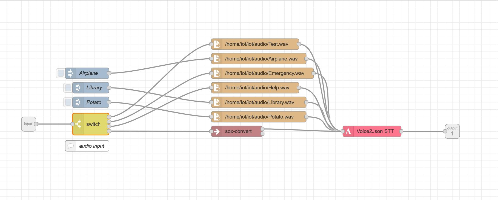

## Project - Help Button

As we couldn't make footmouse, which was our original plan for the IOT module, we decided to do a Call for Help button. This button would allow a disabled employee, to call for help to a responsible Employee who has a Responder. Activating the Call for Help should also be possible via a voice command.

First of all we have set up a simple circuit with a esp32 and a Button to detect the Help Button press. For the responder we wanted to use the M5 stick plus. When setting up the devices with IOT empower we ran into a lot of trouble with the M5 stick. At first it worked as expected, but after turing it off one time it wouldn't get to work anymore. Not a single pin could be manipulated. We ried a lot of things, including updating the PI, testing out different pins, reinitializing the device, etc...

Because nothing worked we decided to emulate the M5 stick by just using a normal esp32 and a breadboard, with a Buzzer and an OLED screen, as can be seen in the image.
    

To controll the responder we used IOT Empower, with the following code.
    

Next we created a complex NodeRED flow. We wanted to be able to connect multiple help-buttons with multiple responders. Therefore we implemented dynamic subscription where help-buttons and responders have IDs, which are passed on to the respective topic. Our first flow listens for the different methods to create a help call and forwards it to the second flow.
    

The second flow, starts and stops the buzzer of the responder and sets the OLED screen. 
    

We also wanted to be able to induce the help call with a voice command. Therefore we used the NodeRED plugin "Voice2JSON" with which we could successfully identify the words "help" and "emergency" to trigger the responder. For voice input we used the NodeRED UI as we didn't have enough time left to implement it with the help-button device.
    

