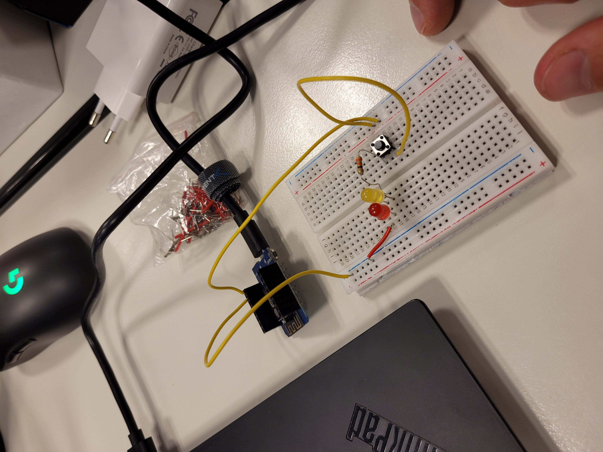
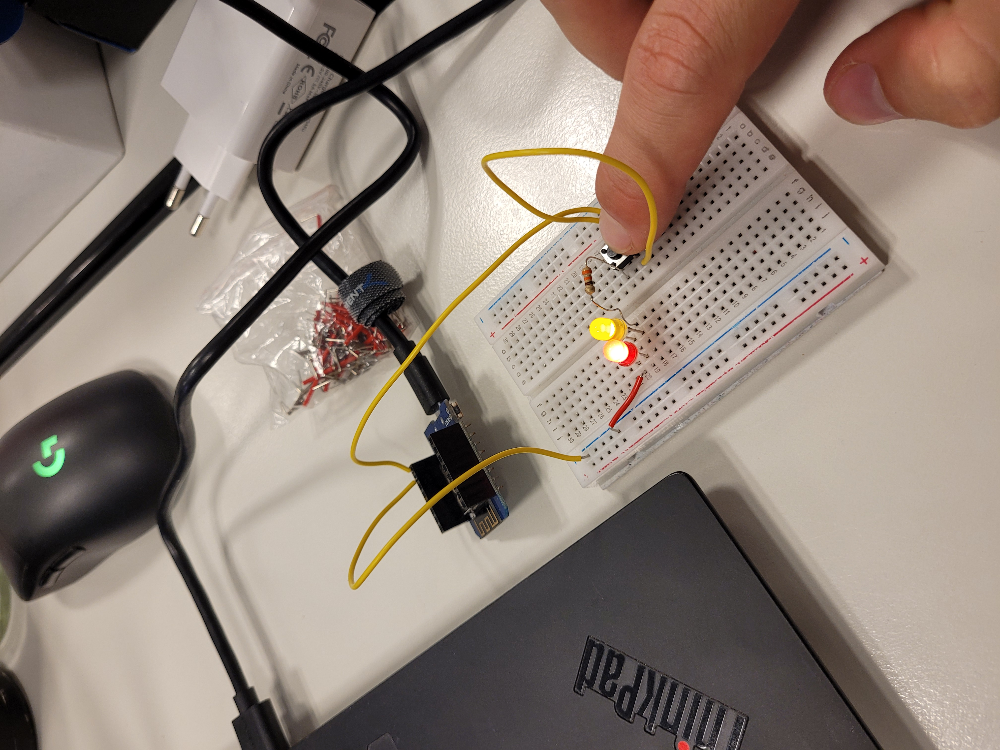
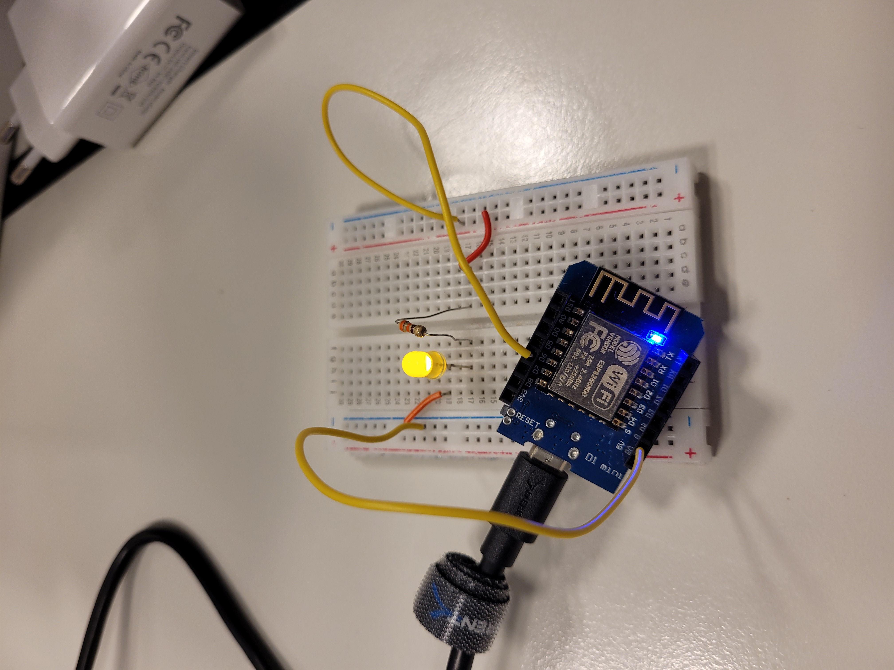

# Exercise 01
For the first exercise we wrote three small Arduino programs.

## Tasks

### Making a LED that's controllable with a Button
Therfore we connected the D1 Mini to a 5V Powersource, in our Case our Laptop port via USB. Next we connect the 5V Pin to a Switch. Then we connect the Switch to a 330Ohm Resistor which is then connected to the LED. Finally The LED is connected with the Ground Pin of the D1 Mini. When Power is applied the LEDs light up whenever the Button is pressed
 
 

### Making LEDs blink with Wemos D1 Mini
#### Preperation
First of all we googled the Wemos D1 Mini to get to know it's capapbilities, and what coresponding Pin numbers are.

Then we installed the Arduino IDE as well as the ch340 drivers.
Then we added our Wemos D1 Mini to the Arduino IDE. Therfore we had to first navigate to "File > Preferences > additional boards manager URLs" and add the provided JSON file so our Microcontroller can be recognised. Next we went to "Tools > BoardManager" and installed "esp8266".

#### Implementation
After the Preperations have been done we set up our circuit. Therfore we connect the D6 Pin with the 330Ohm Resistor, next to the LED and then back to the Ground Pin.

Next we wrote the script to controll the blinking. Therfore we first selected a premade Blinking Script from the Arduino IDE. There we just added the D6 Pin (corresponding ID is 12) and switching it between LOW and HIGH after every Second. One thing to note is, that the onboard LED is just on when it's on LOW compared to the external LED which is lights up on HIGH. As the two LEDs should blink synchronously we alway set one LED on HIGH and one on LOW, which can be seen in our [Code](Code/blink.ino).

## Problems and Conclusion
We have fried one LED because we connected it and didn't have the resistor placed yet.
