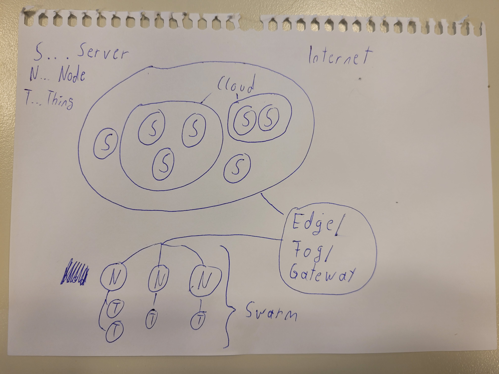

### Storie draft with feedback
Roos, a 27-year-old colleague at our company, faced a challenging situation after a life-altering accident that left her without the use of both  arms. Her desire to regain her independence in using a computer was strong. She discovered the Foot Mouse device and was determined to make it work for her.

After obtaining the Foot Mouse and installing the necessary app, Roos started the setup process, which turned out to be surprisingly straightforward, just like with any other mouse. She customized the mouse sensitivity to ensure the cursor moved precisely the way she wanted, using her foot to control it.

At first, using the Foot Mouse presented Roos with a learning curve. It was a different way of interacting with her computer, and it took some time to adapt. However, Roos was a determined individual. She practiced diligently, and soon enough, she overcame the initial challenges. The Foot Mouse quickly became an extension of her abilities, and she found herself navigating her computer with ease.

In her company Roos worked in the Marketing Team therefore she often has to write emails. Now she can easily open up the Outlook Email browser with the footmouse. Next she can start to record her voice to write out exactly the text she wants to write. Whenever there are just short texts she might as well use the keyboard with her other foot. But whenever she has to write longer texts she prefers to use the windows voice recognition tool. When she is done with her email she just presses the send Button efortlessly.

With the Foot Mouse in place, Roos experienced a newfound sense of empowerment. She could effortlessly navigate her computer, from browsing websites and managing her emails to actively participating in various projects. The Foot Mouse had given her the autonomy she so dearly longed for.

Roos' success didn't go unnoticed in the company. Her story served as an inspiration to her colleagues, many of whom were unaware of the possibilities this device could offer. Recognizing the significance of this technology, the HR department made the Foot Mouse available to anyone within the company who required it.

### Io Tempower Gateway

## Potential steps and challenges
We will have to install a Image on the Raspberry PI and then have to make a Web Request to the Wemos Mini. 

## Implementation

Flash SD Card with the provided Raspberry PI image.

When RapsberryPI gets powered it automatically acts as a Router.

Change Wifi password in the wifi.txt file.

Then we had to sudo poweroff the Raspberry PI so it will be shutdown cleanly, because we had to change Classroom.

After that we used the Arduino IDE write the Programm for the Wemos Mini to be able to switch its LED. Therfor we used the HelloServer Template as a startingpoint. There we set the credentials for the WIFI from the Raspberry PI Router. Next at the Serial Monitor we can see that the Microcontroller has successfully connected to the RaspberryPI. After that we can set up a basic Web server which returns some Plain text when it's being accessed.
Next we add Two Enpoints, a "/on" and a "/off". When these are accessed the LED is being switched off and on.

### Architecture and Terminology IoT

Internet: The IoT architecture's backbone, enabling global connectivity for devices to communicate with each other and external services.

Server: Centralized components responsible for receiving, processing, and storing data from IoT devices, effectively managing data flows.

Cloud Computing: Remote data centers used for storing, processing, and scaling IoT data. Ideal for managing large volumes of information and long-term storage.

Edge Computing: Local data processing near IoT devices, reducing latency and allowing real-time analysis. Devices can make autonomous decisions at this level.

Fog Computing: An intermediary layer that sits between the edge and the cloud. It facilitates distributed data processing and selective data transmission to the cloud, reducing latency and conserving bandwidth.

Swarm: A collective group of interconnected IoT devices that work together as a unified system to achieve specific goals, such as distributed sensing, monitoring, or autonomous actions.

Things: Refers to the IoT devices themselves, which are embedded with sensors, connectivity, and data collection capabilities. These can range from sensors in industrial equipment to smart home appliances.

Gateway: Devices that act as intermediaries between IoT devices and other parts of the IoT architecture. They perform functions like data aggregation, protocol translation, and secure communication.

Nodes: Individual IoT devices such as sensors and actuators, forming the fundamental building blocks of the IoT ecosystem. These nodes interact with other components, including gateways and servers, to exchange data and make the IoT system function

A visual Representation can be seen in the following image:

